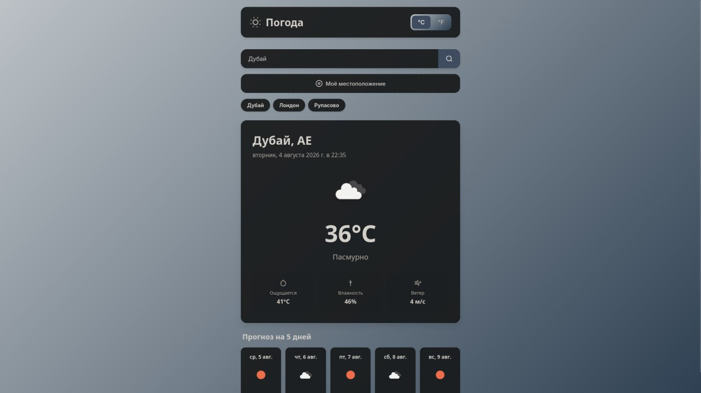
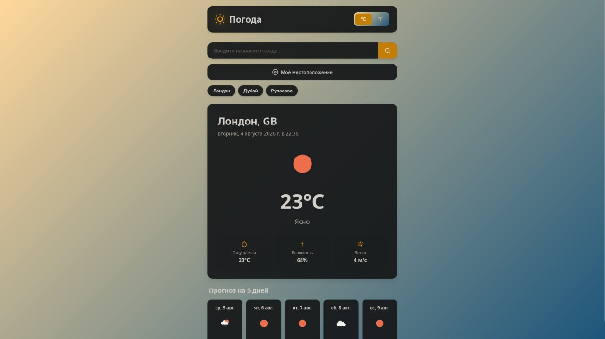
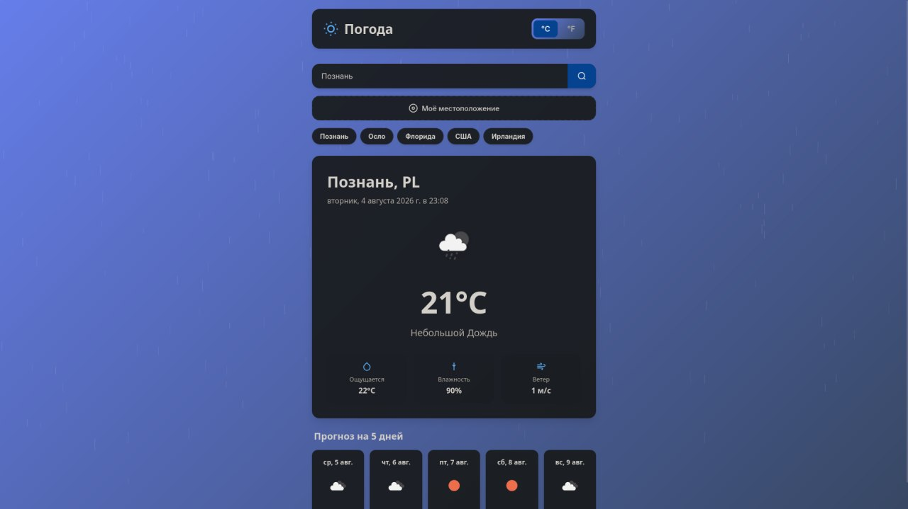

# 🌤️ Weather App — Веб-приложение погоды

Современное, полнофункциональное веб-приложение для отображения текущей погоды и прогноза на 5 дней с анимированными эффектами и адаптивным дизайном.

## 📸 Скриншоты





## ✨ Возможности

### Основные функции
- 🔍 **Поиск по городу** — введите название любого города для получения актуальной погоды
- 📍 **Геолокация** — автоматическое определение погоды в вашем местоположении
- 🌡️ **Переключение единиц** — выбор между Цельсием (°C) и Фаренгейтом (°F)
- 📅 **Прогноз на 5 дней** — детальный прогноз погоды на ближайшие дни
- 💾 **История поиска** — последние 5 городов сохраняются локально

### Визуальные эффекты
- 🎨 **Динамические темы** — фон меняется в зависимости от погоды:
  - ☀️ Солнечно — теплый градиент с пульсирующей иконкой
  - 🌧️ Дождь — анимация падающих капель
  - ❄️ Снег — падающие снежинки
  - ☁️ Облачно — серые тона
  - 🌫️ Туман/дымка — приглушенные цвета
- ⏳ **Skeleton Loading** — элегантные анимированные заглушки при загрузке
- 🎭 **Плавные анимации** — transitions и keyframes для всех элементов

### Технические особенности
- ♿ **Доступность** — семантический HTML5, ARIA-атрибуты, поддержка клавиатурной навигации
- 📱 **Адаптивность** — оптимизация для мобильных устройств и планшетов
- 🎯 **Debounce** — оптимизация запросов к API
- 🔒 **Обработка ошибок** — понятные сообщения при сбоях сети или неверном вводе
- 🚀 **Чистый код** — разделение ответственности, async/await, функциональный подход
- 🔐 **Безопасность** — API ключ не комититится в репозиторий

## 🚀 Быстрый старт

### 1. Клонирование репозитория

```bash
git clone <url-репозитория>
cd Weather
```

### 2. Получение API ключа

Приложение использует **OpenWeatherMap API** для получения данных о погоде:

1. Перейдите на [https://openweathermap.org/api](https://openweathermap.org/api)
2. Зарегистрируйтесь или войдите в аккаунт
3. Перейдите в раздел **API keys**
4. Скопируйте ваш API ключ (или создайте новый)

> ⚠️ **ВАЖНО: Активация нового API ключа НЕ происходит мгновенно!**
> 
> После создания ключа нужно подождать:
> - **Минимум:** 10-15 минут
> - **Обычно:** 1-2 часа
> - **Максимум:** до 24 часов (редко)
>
> Если сразу после создания ключа появляется ошибка "Ошибка API ключа" — это нормально! Подождите 15-30 минут и попробуйте снова. Сам ключ и код приложения работают корректно.

### 3. Настройка конфигурации

**Вариант 1: Используя config.js (рекомендуется для локальной разработки)**

```bash
# Скопируйте файл-шаблон
cp config.example.js config.js
```

Откройте `config.js` и замените `YOUR_API_KEY_HERE` на ваш реальный ключ:

```javascript
const OPENWEATHER_API_KEY = 'abcd1234efgh5678ijkl9012mnop3456';
```

**Вариант 2: Используя .env (для будущей интеграции с бандлером)**

```bash
# Скопируйте файл-шаблон
cp .env.example .env
```

Откройте `.env` и замените `YOUR_API_KEY_HERE` на ваш реальный ключ:

```
OPENWEATHER_API_KEY=abcd1234efgh5678ijkl9012mnop3456
```

> 🔒 **Важно:** Файлы `config.js` и `.env` добавлены в `.gitignore` и не будут закоммичены в репозиторий.

### 4. Запуск приложения

Откройте файл `index.html` в браузере:

**Вариант 1:** Двойной клик по файлу `index.html`

**Вариант 2:** Используйте локальный сервер (рекомендуется):

```bash
# Используя Python 3
python -m http.server 8000

# Используя Node.js
npx http-server

# Используя PHP
php -S localhost:8000
```

Затем откройте в браузере: `http://localhost:8000`

### 5. Проверка активации API ключа

Если сразу видите ошибку "Ошибка API ключа" — не паникуйте! Это значит, что ключ еще не активирован.

**Автоматическая проверка активации:**

```bash
# Запустите скрипт, который проверяет ключ каждую минуту
./check-api-key.sh
```

Скрипт уведомит вас, когда ключ станет активным.

**Ручная проверка:**

```bash
curl "https://api.openweathermap.org/data/2.5/weather?q=London&appid=ВАШ_КЛЮЧ&units=metric"
```

Если видите JSON с данными погоды (а не ошибку 401) — ключ активен, просто обновите страницу в браузере.
php -S localhost:8000
```

Затем откройте в браузере: `http://localhost:8000`

## 📁 Структура проекта

```
weather-app/
├── index.html              # Основная структура HTML
├── style.css               # Стили, темы, анимации
├── script.js               # Логика приложения
├── config.js               # Конфигурация API (не комититится)
├── config.example.js       # Шаблон конфигурации
├── .env                    # Переменные окружения (не комититься)
├── .env.example            # Шаблон переменных окружения
├── .gitignore              # Исключения для Git
└── README.md               # Документация
```

## 🔐 Безопасность

### Файлы, которые НЕ комититятся в Git:

- `config.js` — содержит ваш API ключ
- `.env` — переменные окружения с секретами
- Логи, кэши, временные файлы

### Файлы-шаблоны для новых разработчиков:

- `config.example.js` — шаблон конфигурации
- `.env.example` — шаблон переменных окружения

**При клонировании репозитория:**
1. Скопируйте `config.example.js` → `config.js`
2. Вставьте свой API ключ в `config.js`
3. Не делитесь `config.js` с другими

## 🎨 Архитектура кода

### Разделение ответственности

**`script.js`** организован в модульные блоки:

```javascript
// Конфигурация API
const API_CONFIG = { ... }

// Управление состоянием
const STATE = {
    currentUnit: 'metric',
    currentWeatherData: null,
    searchHistory: []
}

// Кэширование DOM элементов
const DOM = { ... }

// Утилиты (debounce, форматирование дат, конвертация)
function debounce() { ... }
function formatDate() { ... }

// API функции (изолированные запросы)
async function fetchWeatherByCity() { ... }
async function fetchWeatherByCoords() { ... }

// Функции отображения (обновление DOM)
function renderWeather(data) { ... }
function renderForecast(data) { ... }

// Обработчики событий
function handleSearch() { ... }
function handleGeolocation() { ... }
```

### Ключевые паттерны

- **Async/await** — для всех сетевых запросов
- **Debounce** — задержка 300мс для оптимизации
- **LocalStorage** — сохранение истории поиска
- **CSS Custom Properties** — темизация через переменные
- **Функциональная композиция** — чистые функции без побочных эффектов

## 🌍 Использование API

Приложение делает следующие запросы к OpenWeatherMap:

### Текущая погода по городу
```
GET https://api.openweathermap.org/data/2.5/weather
?q={city}&appid={key}&units=metric&lang=ru
```

### Текущая погода по координатам
```
GET https://api.openweathermap.org/data/2.5/weather
?lat={lat}&lon={lon}&appid={key}&units=metric&lang=ru
```

### Прогноз на 5 дней
```
GET https://api.openweathermap.org/data/2.5/forecast
?q={city}&appid={key}&units=metric&lang=ru
```

## 🎯 Браузерная совместимость

- ✅ Chrome 90+
- ✅ Firefox 88+
- ✅ Safari 14+
- ✅ Edge 90+

**Требуемые API:**
- Fetch API
- LocalStorage
- Geolocation API (опционально)
- CSS Custom Properties
- CSS Grid & Flexbox

## 🛠️ Кастомизация

### Изменение цветовой схемы

Откройте `style.css` и измените CSS переменные в `:root`:

```css
:root {
    --bg-primary: #f0f4f8;
    --accent-color: #3b82f6;
    /* ... */
}
```

### Добавление новых погодных тем

1. Добавьте тему в `style.css`:
```css
body.theme-НАЗВАНИЕ {
    --bg-primary: linear-gradient(...);
    --accent-color: #...;
}
```

2. Обновите функцию `getWeatherTheme()` в `script.js`:
```javascript
const themeMap = {
    'название': 'НАЗВАНИЕ',
    // ...
};
```

### Изменение количества городов в истории

В `script.js` найдите функцию `addToHistory()` и измените `.slice(0, 5)` на нужное значение.

## 🐛 Решение проблем

### "Ошибка API ключа"
- Убедитесь, что ключ активирован (может занять до 2 часов)
- Проверьте правильность вставки ключа в `config.js`
- Убедитесь, что `config.js` загружается перед `script.js` в `index.html`

### "Город не найден"
- Используйте английское или официальное название города
- Попробуйте добавить название страны: "Moscow, RU"

### "Доступ к геолокации запрещен"
- Разрешите доступ к геолокации в настройках браузера
- Для HTTPS требуется безопасное соединение

### Анимации не работают
- Проверьте, не включена ли опция "Уменьшение движения" в настройках ОС
- Убедитесь, что используете современный браузер

### config.js не найден
- Убедитесь, что скопировали `config.example.js` в `config.js`
- Проверьте, что файл находится в корне проекта

## 🚀 Развертывание

### GitHub Pages

1. Создайте копию `config.example.js` с именем `config.js` в отдельной ветке для деплоя
2. Вставьте API ключ в `config.js`
3. Задеплойте эту ветку на GitHub Pages
4. **Не мержите** эту ветку обратно в main!

### Netlify / Vercel

Для production-деплоя рекомендуется использовать переменные окружения:

1. Добавьте `OPENWEATHER_API_KEY` в Environment Variables платформы
2. Настройте build-процесс для подстановки ключа в `config.js` при сборке

## 📝 Contributing

1. Форкните репозиторий
2. Создайте feature-ветку: `git checkout -b feature/amazing-feature`
3. Закоммитьте изменения: `git commit -m 'Add amazing feature'`
4. Запушьте в ветку: `git push origin feature/amazing-feature`
5. Откройте Pull Request

**⚠️ Важно:** Убедитесь, что не комитите файлы `config.js` или `.env`!

## 📝 Лицензия

MIT License — свободное использование для личных и коммерческих проектов.

## 🙏 Благодарности

- **OpenWeatherMap** — за предоставление API погоды
- **Иконки** — встроенные SVG иконки

---

**Разработано с ❤️ для изучения современной веб-разработки**

Вопросы? Создайте issue или отправьте pull request!
